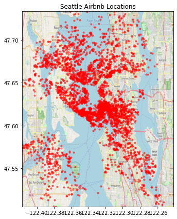

# Seattle Airbnb Analysis

1. [ Introduction. ](#Introduction)
2. [ Analysis. ](#Analysis)
3. [ Additional Information. ](#Additional-Information)
4. [ References.](#References)
5. [ Conclusion. ](#Conclusion)

## Introduction
As a part of Udacity Data Science Nanodegree, I created an analysis on Seattle Airbnb data.
Supposed that we want to improve our customers' satisfaction, we should understand about the condition of our business and the feedback of our customers.
To do this, there are many questions can be asked, but in this analysis I would like to focus on answering these questions :
1. How occupied were the Airbnb housings in Seattle?
2. Is there any significant differences of average reviews scores between neighbourhood groups?
3. How good or bad were the sentiments of the users to the housings?

## Analysis
After doing the analysis, we can infer that :
1. Some of the housings were always fully occupied, while some others were never be occupied througout the year. Besides, we could also see the declining trend of occupancy throughout the year, except on some certain occasions. 
2. There is mainly no significant difference of the average rating scores for each neighbourhood groups, except for University District, where it was significantly lower than others.
3. Reviewing the feedback from the customers, most of them gave positive feedback, and a significant amount of neutral feedback was given, due to automatic review feature of the application. By using wordcloud, we can see the dominant keywords for both negative and positive feedbacks, which can be utilized as a basis for improvement target.

Additionally, as the listing data contains longitude and latitude data, we can visualize them on a map.

## Additional Information
The libraries I used to support this analysis are including numpy, pandas,matplotlib, nltk, langdetect, and wordcloud.
This repository contains the Jupyter Notebook file of the detailed analysis and code, as well as the necessary data : calendar, listings, and reviews, which are located in seattle.zip file.
1. calendar.csv
This dataset shows the daily availability of each housing. 
2. listings.csv
This dataset shows the current profile of each listings.
3. reviews.csv
This dataset shows the reviews by users.

You can access the repository through this link : https://github.com/vinezhapanca/Seattle-Airbnb-Analysis

I have also written a blog post about this analysis, which can be accessed here : https://medium.com/@vinezha.panca/seattle-airbnb-data-analysis-a55d43cb260d

## References
Some external references I used to improve my analysis are :
1. https://medium.com/@b.terryjack/nlp-pre-trained-sentiment-analysis-1eb52a9d742c
2. https://pypi.org/project/langdetect/
3. https://www.datacamp.com/community/tutorials/wordcloud-python
4. https://towardsdatascience.com/easy-steps-to-plot-geographic-data-on-a-map-python-11217859a2db

## Conclusion
We can evaluate the occupancy of the housings by seeing how many of the housings are always fully booked or idle, also the trend of the occupancy over time.

We can evaluate the rating scores further by seeing whether the scores vary significantly between the neighbourhood groups.

By utilizing natural language processing (sentiment analysis, wordcloud), we can dig deeper through the reviews and pinpoint what we should improve.

